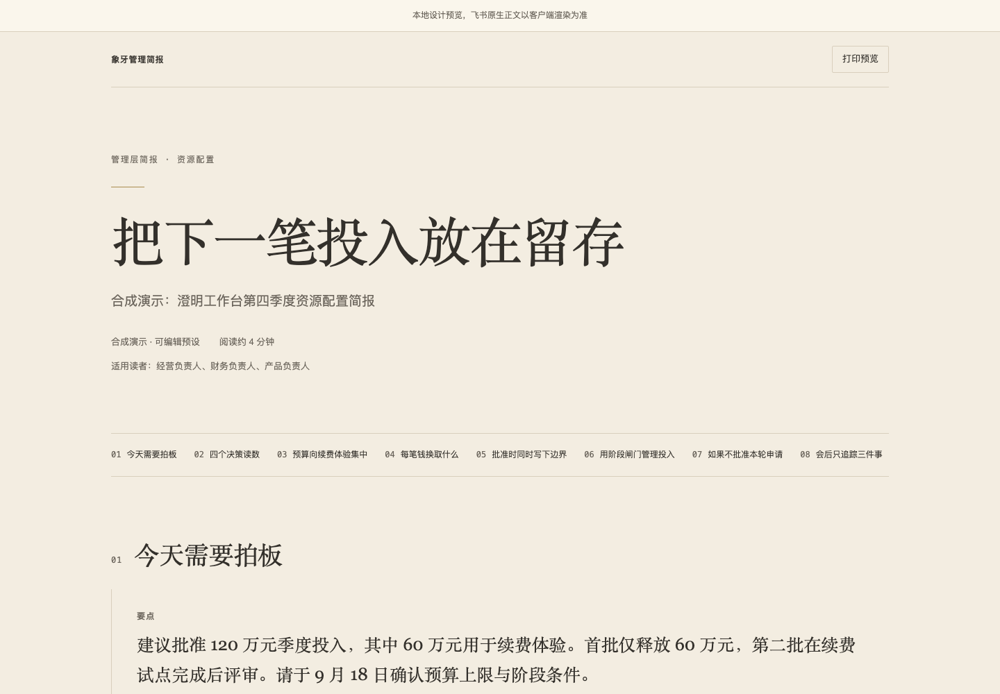
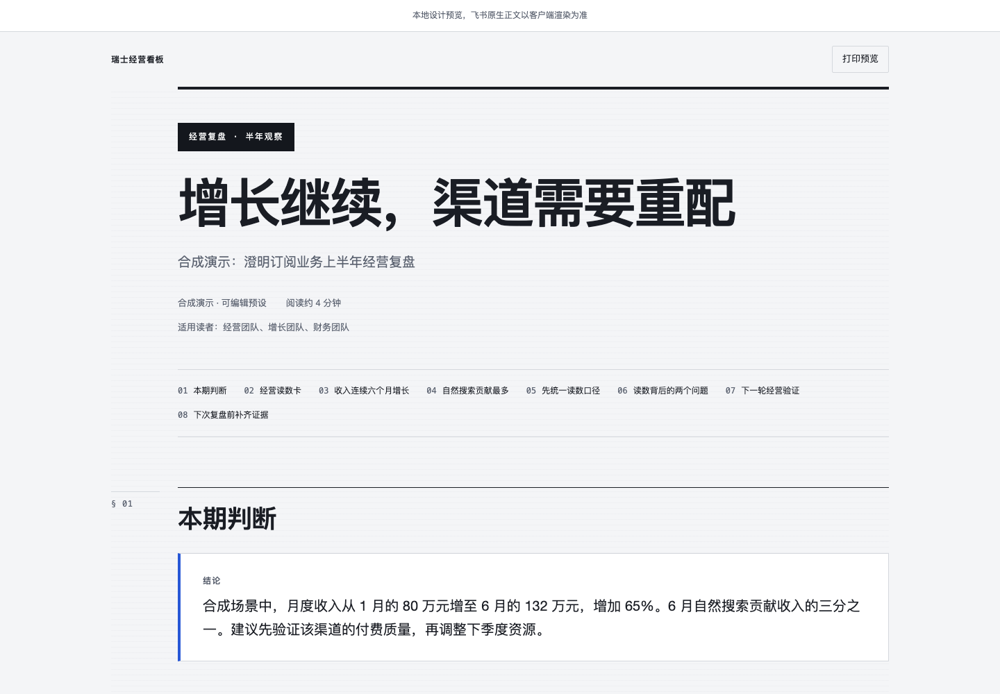
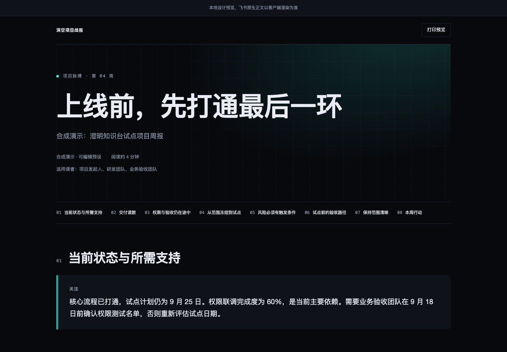
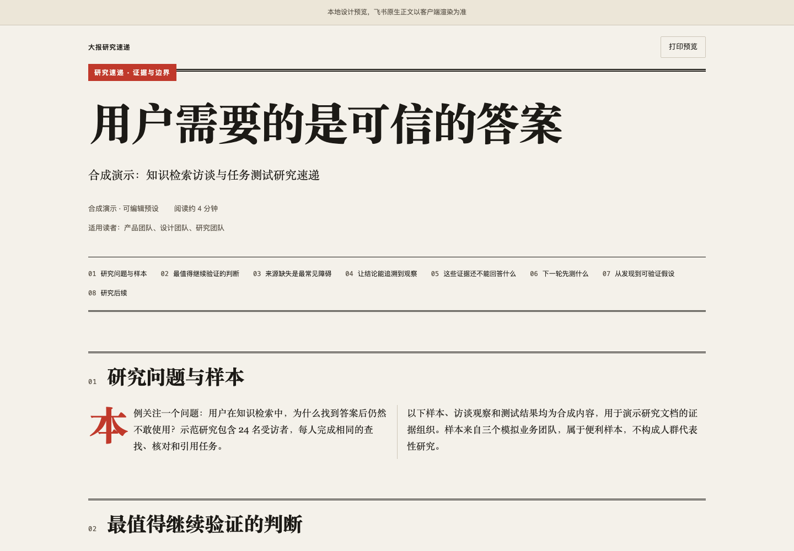
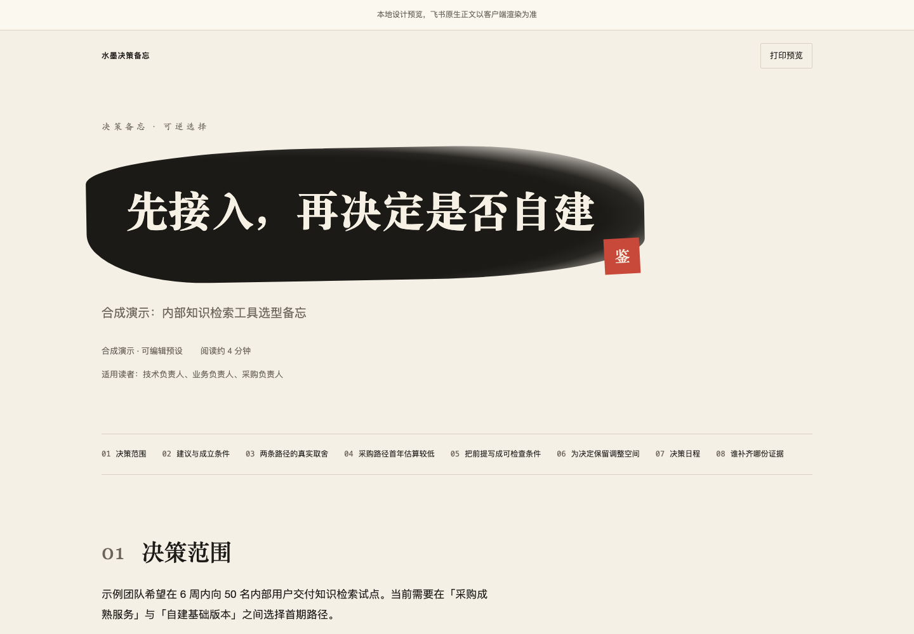
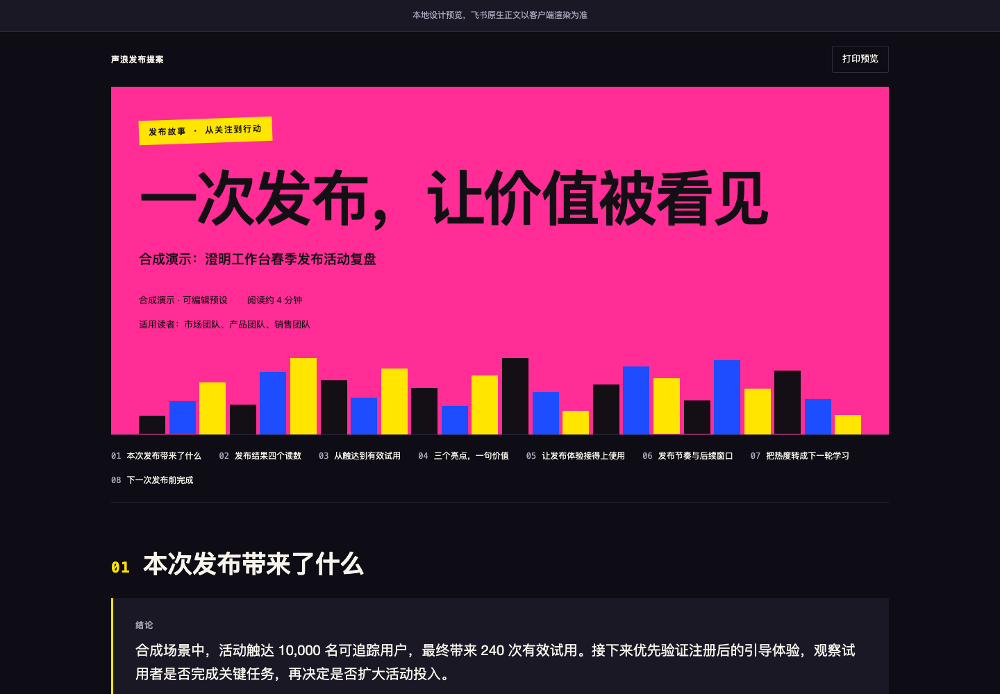

# heige-feishu-word

**让每份飞书汇报，都有自己的视觉语言。**

把结构化内容编译成原生可编辑的飞书正文、数据图表、主题开篇画板和离线预览。六套场景模板可以直接生成、替换数据、换主题。适用于管理简报、经营复盘、项目同步、研究速递、方案评审与发布提案。

当前开发版本：`v0.2.0a0`。本地编译不需要账号、不联网，运行时只用 Python 标准库。飞书写入由独立的 Lark CLI 完成。

## 六套模板

| 模板 | 视觉主题 | 读者首先得到什么 |
| :--- | :--- | :--- |
| `executive-brief` | 象牙管理简报 | 决策建议、投入与影响 |
| `operating-review` | 瑞士经营看板 | 趋势、偏差和渠道贡献 |
| `project-pulse` | 深空项目战报 | 当前进展、风险与下一里程碑 |
| `research-digest` | 大报研究速递 | 核心发现、证据与研究局限 |
| `decision-memo` | 水墨决策备忘 | 同口径方案比较与取舍 |
| `launch-story` | 声浪发布提案 | 发布亮点、转化漏斗和行动 |

模板使用明确标注的合成演示数据。正式汇报前请替换数值、口径、来源、日期和责任人。

下方是实际生成的离线预览截图，飞书原生正文以客户端渲染为准。可直接使用 [六份可替换内容的 JSON 样例](examples/presets)。

| 象牙管理简报 | 瑞士经营看板 |
| :--- | :--- |
|  |  |
| 深空项目战报 | 大报研究速递 |
|  |  |
| 水墨决策备忘 | 声浪发布提案 |
|  |  |

## 三分钟开始

Python 3.9 或更高版本。

```bash
git clone https://github.com/HeiGeAi/heige-feishu-word.git
cd heige-feishu-word
python3 -m pip install .

# 查看场景与视觉主题
heige-feishu-word presets
heige-feishu-word themes

# 创建可编辑的结构化示范正文
heige-feishu-word init executive-brief --output my-report.json

# 替换 my-report.json 中的业务内容后编译
heige-feishu-word compile my-report.json --output build/my-report

# 一次生成六套样本与离线画廊
heige-feishu-word gallery --output build/gallery
```

打开 `build/gallery/index.html` 选择模板，或打开 `build/my-report/preview.html` 查看一份报告。也可以不安装，给上述命令加 `PYTHONPATH=src python3 -m heige_feishu_word` 入口。

同一份内容可以换主题：

```bash
heige-feishu-word compile my-report.json --theme nocturne-teal --output build/my-report-dark
```

## 图表与组件

五类数据图表：横向条形、折线、环形、转化漏斗、目标完成度。还支持结论高亮、KPI 指标组、原生表格、两栏内容、流程画板、行动清单、连续段落、里程碑时间轴和方案比较。

每张数据图必须提供来源与结论。图后附原生数据表，保留精确数值和编辑能力。负数、零基线、占比总和、漏斗顺序、百分比范围和文字容量都有验证。非法数据与无法容纳的文字会明确报错，不静默删减。

```json
{
  "schema_version": "0.2",
  "theme": "atelier-bone",
  "meta": {
    "title": "经营复盘",
    "subtitle": "先看变化，再决定下一步",
    "eyebrow": "MONTHLY REVIEW",
    "disclaimer": "合成演示数据，使用前替换。"
  },
  "sections": [{
    "id": "channels",
    "type": "chart",
    "title": "渠道收入比较",
    "kind": "bar",
    "labels": ["产品内转化", "内容渠道", "伙伴推荐"],
    "series": [{"name": "收入", "values": [72, 48, 31]}],
    "unit": "万元",
    "source": "合成演示数据",
    "insight": "产品内转化收入最高，后续需结合成本评估投入。"
  }],
  "assets": []
}
```

[完整内容契约与边界](docs/visual-system/README.md) · [飞书视觉能力研究与官方来源](docs/research/feishu-visual-capabilities.md) · [本轮验收范围](docs/visual-system/validation.md)

## 编译后得到什么

```text
build/my-report/
├── source.body.json
├── document.xml
├── document.enhanced.xml
├── preview.html
├── theme.json
├── manifest.json
├── widgets/overview.html
└── boards/
    ├── __overview.svg
    └── channels.svg
```

填写 `meta.eyebrow` 时生成开篇画板与增强概览；没有该字段时只生成原生正文与内容图表。

- **原生版 `document.xml`**：原生段落、表格、复选项与 SVG 画板。优先用于日常协作。
- **增强版 `document.enhanced.xml`**：将开篇画板替换为 HTML 概览，正文继续使用原生块。需验证租户与客户端支持。
- **离线预览 `preview.html`**：用于选择主题、阅读正文与查看大图。它展示设计意图，不能代替飞书客户端实测。
- **产物清单 `manifest.json`**：记录文件路径、大小与 SHA-256。编译成功的清单仍会明确标记云端尚未发布。

编译器保留 0.1 输入与 `editorial-forest` 主题。输出目录仅在旧产物完整且未被用户修改时允许替换；有新增文件、手动修改或软链接时拒绝覆盖。

## 写入飞书

安装并登录 [官方 Lark CLI](https://github.com/larksuite/cli)，在构建目录执行：

```bash
cd build/my-report
lark-cli docs +create --as user --doc-format xml --content @./document.xml
```

增强版需在同一构建目录运行，确保 HTML 相对路径正确：

```bash
lark-cli docs +create --as user --doc-format xml --content @./document.enhanced.xml
```

只选择其中一个版本创建。不要为了重试回读而反复新建文档。记录创建返回的 URL，核对 `warnings`，随后回读：

```bash
lark-cli docs +fetch --as user --doc '<创建返回的文档URL>' --detail full
```

进一步下载画板缩略图，对照中文字形、数值、折行与连线。创建成功、正文回读通过和视觉验收是三个不同结果。

## 明确的能力边界

原生正文使用飞书的字体、间距与预设色名。精确 HEX 色板和构图作用于 SVG 与 HTML，不能把原生文档换成任意 CSS 皮肤。

SVG 统计图是当前输入的数据快照。修改飞书里的数据表不会自动重绘图表；真正绑定 Sheet 数据源的图表属于后续集成。顶部画板也区别于飞书独立封面资源。

本版没有内置账号认证、无人值守发布、PDF 导出、外部素材导入或实时 Sheet 连接器。原生字体转换、HTML 租户支持、实体手机和 PDF 导出需要分别确认。长期正文阅读、正式制度和公文应选择克制样式。

## 开发与测试

```bash
PYTHONPATH=src python3 -m unittest discover -s tests -v
```

运行时无第三方依赖。浏览器验收脚本使用可选 Playwright，检查桌面与窄屏、资源、交互和 SVG 文字边界，不属于用户安装依赖。

```bash
# 先安装可选 playwright 与 Chromium，再运行
node scripts/check_browser.cjs build/gallery build/browser-evidence
# 非默认安装位置可通过 PLAYWRIGHT_MODULE 指向 playwright 模块
```

公开样本只含合成数据。不提交 Token、Cookie、app secret、个人 open_id、真实客户材料或私人云端回执。SVG 禁止脚本、远程资源与不受支持的滤镜。更多约定见 [CONTRIBUTING.md](CONTRIBUTING.md) 与 [SECURITY.md](SECURITY.md)。

视觉设定适配自 [HeiGe-Design](https://github.com/HeiGeAi/HeiGe-Design)（MIT）：atelier-bone、grid-bureau、nocturne-teal、broadsheet、moxi-void、soundwave-wrapped。图表、内容契约与编译代码均在本仓库。

[MIT License](LICENSE)
