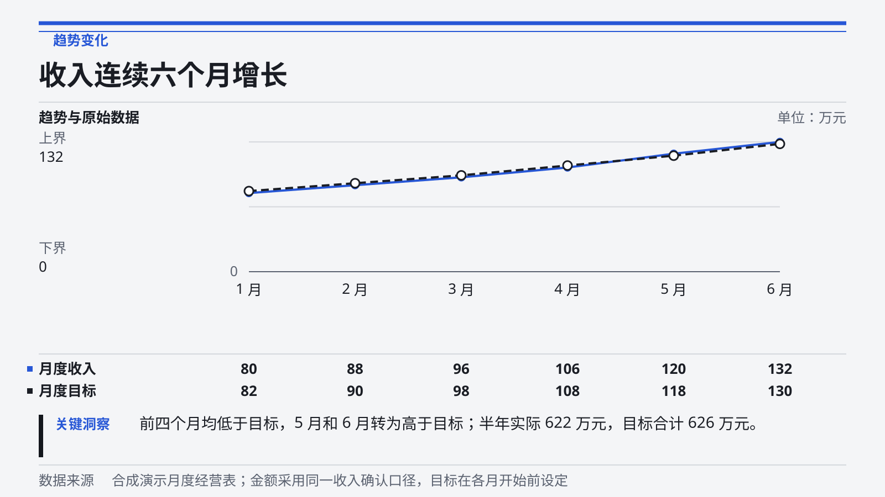
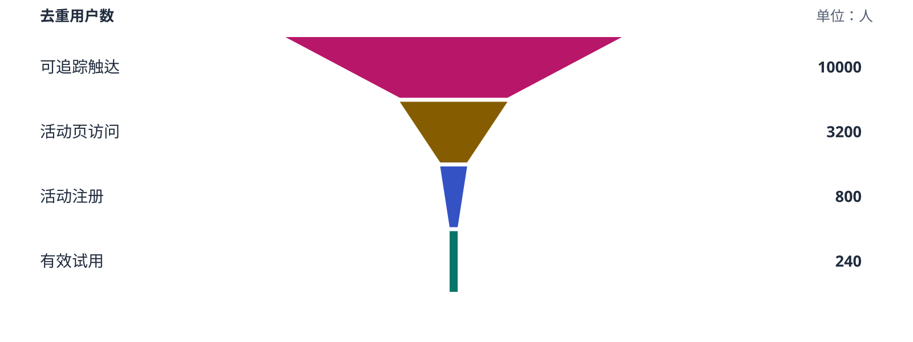

# v0.2.0a1 白页迭代验收

验收日期：2026-09-10。样本均为合成内容，未用于真实业务决策。上一版虽通过内容与几何检查，使用者仍指出整篇观感不足；本轮按飞书白色正文场景重新设计和验收。问题诊断与改动理由见 [白页复审](white-page-review.md)。

| 层级 | 实际验证 | 结果与边界 |
| :--- | :--- | :--- |
| 内容与编译 | 94 项 Python 测试 | 原有 0.1 输入、六预设、五类数据图、负数与比例几何、文本保真、原生明细、容量回退、产物哈希和覆盖保护通过 |
| 本地浏览器 | Chromium，1440px 与 390px | 六模板加画廊共 14 个视口；数据展开、大图放大、适应宽度、原尺寸恢复、两种关闭、减少动态效果等，共 32 条检查通过 |
| 资源与控制台 | 本地页面实际加载 | 无失败资源、控制台错误、页面横向溢出或 SVG 文字超出画布；窄屏图块内部保留横向滚动，避免压成难读小字 |
| 视觉设定 | 六个 heige-design 设定集 lint | 均为 0 error、0 warning；该检查针对来源设定，白页适配效果仍需另看实际文档 |
| 飞书原生正文 | 六份新版文档全文回读 | 去空白后 7271 个正文字符与编译源按顺序一致；创建或更新无警告 |
| 飞书画板 | 16 张最终画板 | 源 SVG 与发布源一致，云端文字与源逐字一致，文档 token 绑定一致；实际 JPEG 全部逐张目视，未发现截断、遮挡或图形越界 |
| 飞书实际页面 | Chrome，1352×654 视口 | 逐一打开六套原生样本并滚动查看关键区段，核对标题、白底图块、表格、流程与正文衔接；管理简报和项目简报的核心判断在首屏可见 |
| HTML 指标增强版 | 独立白页样本 | 1122 个原生字符按顺序一致，1 个 HTML 的 3065 字节下载体与源 SHA-256 一致，2 张画板目视通过；实际 Chrome 显示四列指标并直接接入正文，无重复封面 |
| 安装使用 | 0.2.0a1 Wheel 与隔离虚拟环境 | 安装后实际运行 init、compile，生成完整产物；Python 运行时无第三方依赖 |

## 本轮针对白页修复的问题

1. 去掉开篇海报，保留一次原生主标题与简短元信息。
2. 六套图形共同使用白色背景，主题色集中在读数、系列与小标记。
3. 图中不再复制章节标题、解读和来源，嵌入图改成 1600×600；独立分享图另存为 1600×900。
4. KPI 去掉二级标题编号，使用 1600×380 的四列数字条。五至八项使用两行，超过视觉容量时保留完整原生表格。
5. 四步流程改为单行，五个预设流程的实际节点高度均为 240；自定义较长内容可增加高度，不裁切文字。
6. 完整指标、图表数据与流程文本集中到文末原生明细，避免每张图后立即重复相同内容。来源留在图旁。
7. HTML 增强块只替换第一组可渲染 KPI，不再重复主标题、metadata 和页脚。
8. 本地预览改为 820px 白色阅读栏，同时明确其交互与实际原生附录的区别。

图形变矮来自真实节点重排。仅修改根 SVG 的 viewBox 无法改变飞书所显示的内容边界。

## 可复现的本地检查

```bash
PYTHONPATH=src python3 -m unittest discover -s tests -v
PYTHONPATH=src python3 -m heige_feishu_word gallery --output build/gallery
node scripts/check_browser.cjs build/gallery build/browser-evidence
python3 -m pip wheel . --no-deps --wheel-dir build/dist
```

浏览器脚本需要可选 Playwright 和 Chromium。模块不在默认路径时设置 `PLAYWRIGHT_MODULE`。六份合成 Body 位于 `examples/presets`，README 截图来自离线预览。下方为本轮嵌入图的源 SVG，云端字形以客户端转换为准。





## 完成边界

本轮样本的实际白底节点包括 4 张 1600×380 KPI、7 张 1600×600 数据图和 5 张 1600×240 流程。云端 SVG 导出四边各增加 20px。JPEG 则统一导出为 2560×2560 方形预览，其留白不代表原生文档块高度。

六套原生文档已在当前 Chrome 逐一查看关键区段，未进行实体手机飞书、其他租户、PDF 导出或真实业务数据验收。390px 检查针对离线 HTML，不能替代实体手机。HTML 增强块通过当前账号样本，不代表全部客户端支持。

统计图是输入快照，编辑文末表格不会自动重绘。严格图表容量校验、原生指标回退、自动化测试和设计 lint 各自证明对应规则；整篇审美仍需使用者阅读样本判断，不能由测试数量代替。

原始云端回执、标识、图形导出、哈希与浏览器证据保存在本地私有构建目录，不包含在公开仓库中。此前大封面版本及初版 pilot 的证据单独保留，未计入以上结果。
